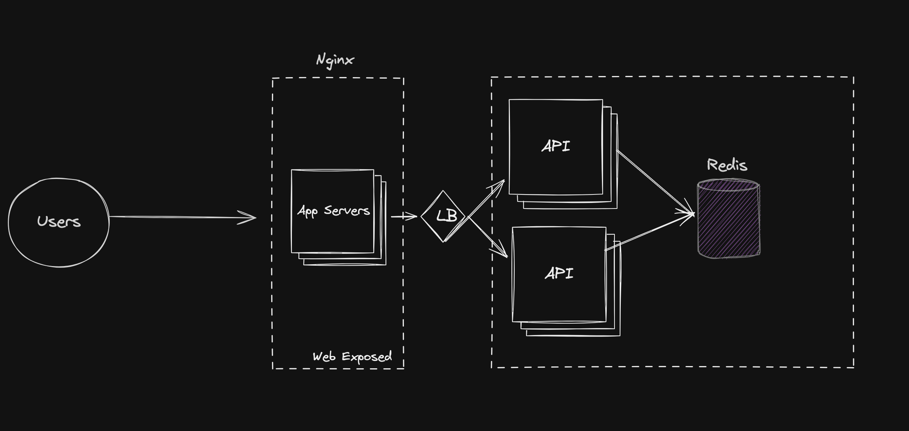

# URL Shortener Service

## Descrição do Projeto

Este projeto é um serviço de encurtamento de URLs implementado em Golang.
Ele permite aos usuários criar links curtos para URLs longas, facilitando o compartilhamento e o gerenciamento de links.

## Características Principais

- Geração de slugs únicos para cada URL
- Possibilidade de customização de slugs pelos usuários
- Redirecionamento de slugs para URLs originais
- API RESTful para criação e gerenciamento de links curtos
- Integração com Redis para armazenamento de dados
- Balanceamento de carga e proxy reverso com Nginx
- Containerização com Docker e orquestração com Docker Compose
- Documentação da API com Swagger

## Arquitetura do Sistema

### Visão Geral da Arquitetura

### Backend (Golang)

O backend é escrito em Golang e utiliza as seguintes bibliotecas principais:

- `github.com/go-redis/redis/v8`: Para interação com o Redis
- `github.com/gorilla/mux`: Para roteamento HTTP
- `github.com/swaggo/http-swagger`: Para documentação da API

### Armazenamento de Dados (Redis)

O Redis é utilizado como banco de dados principal para armazenar os mapeamentos entre slugs e URLs originais. Cada
entrada no Redis tem um tempo de expiração de 30 dias.

### Balanceamento de Carga e Proxy Reverso (Nginx)

O Nginx é configurado como um proxy reverso e balanceador de carga, distribuindo as requisições entre múltiplas
instâncias da API.

### Containerização (Docker)

O projeto utiliza Docker para containerização, garantindo consistência entre ambientes de desenvolvimento e produção.

## Regras de Negócio

1. **Geração de Slugs**:
    - Slugs são gerados automaticamente com 7 caracteres, compostos por letras (maiúsculas e minúsculas) e números.
    - Os primeiros 3 caracteres são baseados no timestamp atual, seguidos por 4 caracteres aleatórios.

2. **Customização de Slugs**:
    - Usuários podem fornecer seus próprios slugs, que devem ter entre 3 e 10 caracteres alfanuméricos.
    - Slugs customizados são verificados para garantir unicidade.

3. **Expiração de Links**:
    - Links curtos expiram após 30 dias de inatividade.

4. **Redirecionamento**:
    - Ao acessar um slug válido, o usuário é redirecionado para a URL original.
    - Slugs inválidos retornam um erro 404.

5. **Estatísticas**:
    - O sistema conta o número de acessos para cada slug.

## Como Executar

1. Certifique-se de ter o Docker e o Docker Compose instalados.
2. Clone o repositório.
3. Na raiz do projeto, execute:

   `docker compose up -d`
4. O serviço estará disponível em `http://localhost/swagger/index.html`.

## API Endpoints

- `POST /api/v1/shortlink`: Cria um novo link curto
- `GET /s/{slug}`: Redireciona para a URL original

